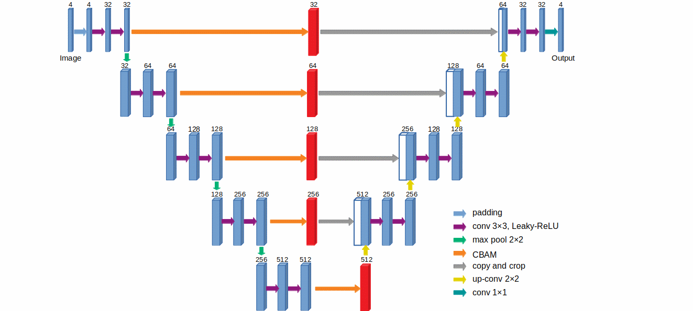

# README

*A modified Unet is used for raw image denoising*

[toc]

## File Directory Description

**-- dataset:**								downloaded dataset

**-- -- dataset:**							training data and ground truth

**-- -- -- noisy:**

**-- --  -- ground truth:**

**-- -- testset:**							  test dataset.

**-- doc:**

**-- src:**										  code for model definition, training, testing, and so on.

**-- -- lib:**										the results of pre-trained Unet model as well as some basic code 

**-- -- model:**								Pre-trained modified Unet model

**-- -- runs**									denoised test set

## Model

​	Since the feature receptive fields extracted by Unet in each feature layer are limited, in order to add global information to the features of each layer, the model is improved by inserting CBAM module into the feature extraction of each layer. The modified model is shown in the figure above. 

## Dataset

The dataset adopted the data set provided by [ZXPY Image Processing Algorithm Competition](https://zte.hina.com/zte/denoise/desc), which contained 200 raw images, including 100 noise images and 100 ground truth images. The default raw image value ranges from 1024 to 16383.

## Training

80% of the dataset is used as training set and the others are testing set. Parameters are initialized by pre-trained Unet. Model is trained for 300 epoch with batch size of 1. Learning rate is start from 0.001 and  reduce 0.5 times when reached the epoch of 90 and 240.

The result of modified Unet in PSNR and SSIM were 46.3988 and 0.99418 respectively.

## Data & Result

The dataset and pre-trained model can be download [here](https://pan.quark.cn/s/7e8a6ce92c2c)

